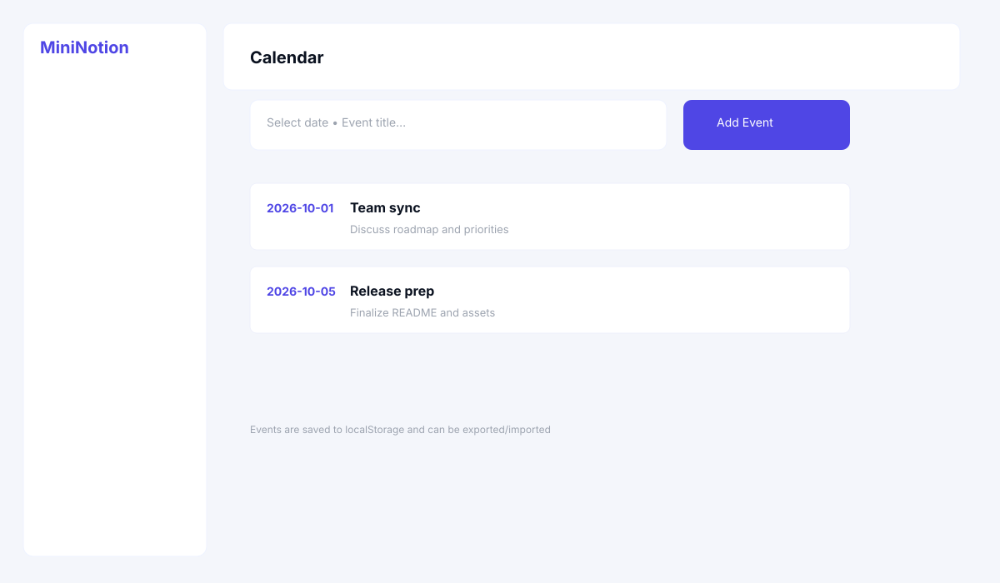

## Reflection — MiniNotion (visual notes)

What did you ask Copilot to help you build? How did you break down the problem?

I asked Copilot to help me make a productivity app like notion using html, css, and javascript. I broke the problem down by visualzing what I was given and redirecting Copilot to the final result I was satisfied with.

How did your approach to asking questions change as you worked?

My approach to asking questions changed because the questions I asked became more and more particular for the specifications of particular features within the app.

What parts of the development process with GitHub Copilot suprised you?

Something that I found suprising is that sometimes the AI didn't know what I was asking despite how clear my questions were.

What did you learn about the technology you used that you didn't know before?

How to actually direct an agent to complete task's quickly and effectively.

What would you do differently if you had to build this again?

I would definitly create a mind map to make the app a bit more successful but it was fun knowing that I could get to a moc result of the app Notion.

### Tasks view (mockup)

### Calendar view (mockup)

End of reflection.
