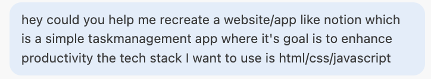
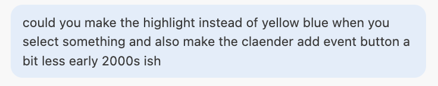
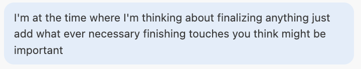
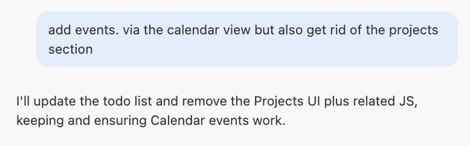
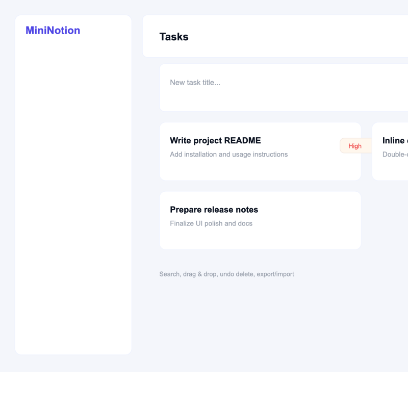
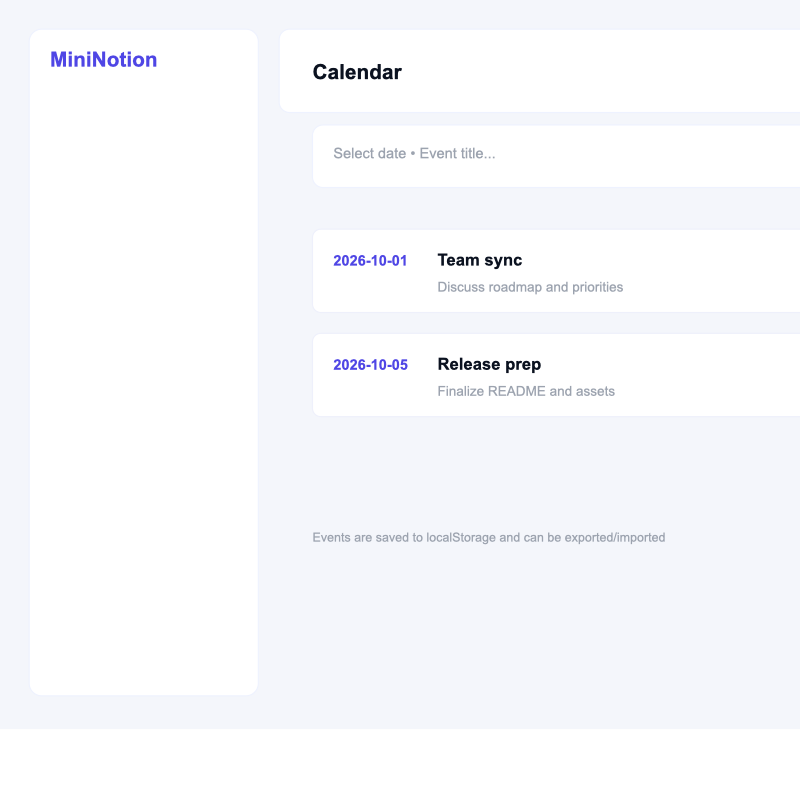

## Reflection — MiniNotion (visual notes)

**What did you ask Copilot to help you build? How did you break down the problem?**

**Prompt:**

I asked Copilot to help me build a productivity app inspired by Notion using HTML, CSS, and JavaScript. I broke the problem down by visualizing the desired result and guiding Copilot toward the final version I wanted.

**How did your approach to asking questions change as you worked?**

**Prompt:**

My questions became more specific as I refined the requirements for individual features in the app.

**What parts of the development process with GitHub Copilot surprised you?**

**Prompt:**

I was surprised that sometimes the AI did not understand my intent, even when I thought my questions were clear.

**What did you learn about the technology you used that you didn't know before?**

**Prompt:**

I learned how to direct an agent to complete tasks quickly and effectively.

**What would you do differently if you had to build this again?**

I would definitely create a mind map to plan the project more thoroughly. That said, it was fun to discover that I could produce a Notion-like mockup quickly.

### Tasks view (mockup)

### Calendar view (mockup)

End of reflection.
